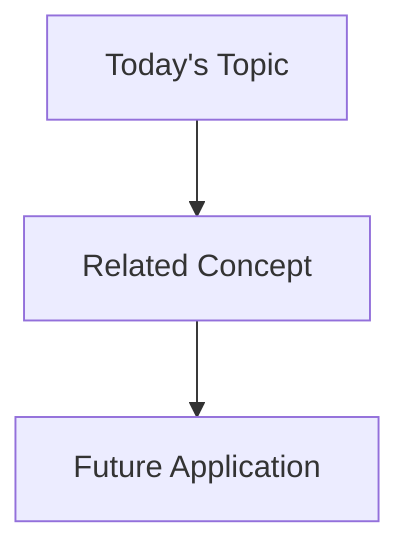

# Daily Learning Notes Template - [YYYY-MM-DD]

## 🎯 Quick Summary
**Today's Focus**: [Main topic/module you're working on]
**Module**: [Current module number and name]
**Progress**: [X]% through current module
**Energy Level**: [Low/Medium/High]
**Key Win**: [One main achievement today]

## 📅 Time Blocks
### 🌅 Morning Session [Time]
#### What I Worked On
- [ ] Task 1
- [ ] Task 2

#### Key Learning Points
```code
# Include any important commands, code, or syntax learned
```

#### Challenges Faced
- **Challenge**: [Describe the challenge]
  - **Solution Attempted**: [What you tried]
  - **Outcome**: [What happened]
  - **Next Steps**: [What to try next]

### 🌞 Afternoon Session [Time]
[Same structure as morning session]

### 🌙 Evening Review [Time]
[Same structure as morning session]

## 💡 Today's Key Insights
1. **Technical Insights**:
   - Insight 1
   - Insight 2

2. **Process Insights**:
   - Insight 1
   - Insight 2

3. **Personal Learning Style Insights**:
   - What worked well
   - What didn't work

## 🤔 Questions & Clarifications Needed
### Active Questions
- [ ] Question 1
  - **Context**: [Why this is important]
  - **Research**: [What you've found so far]
  - **Next Step**: [How to find answer]

### Resolved Questions
- [x] Question 1
  - **Answer**: [The solution]
  - **Source**: [Where you found it]
  - **Related Topics**: [Links to related concepts]

## 🔄 Connections & Patterns
### Links to Previous Learning
- Connection to [Previous Topic/Module]
- Pattern noticed in [Area]

### Visual Connections


## 📚 Resources Used Today
### Official Documentation
- [Link Description](URL)

### Helpful Articles/Videos
- [Link Description](URL)

### Tools Used
- Tool 1: [Purpose/Usage]
- Tool 2: [Purpose/Usage]

## 🐛 Bugs & Issues Encountered
### Issue 1
- **Description**: [What happened]
- **Environment**: [Relevant setup details]
- **Error Message**:
  ```
  [Error message here]
  ```
- **Resolution/Workaround**: [How you fixed it]

## 📈 Progress Tracking
### Completed Today
- [x] Task 1
- [x] Task 2

### In Progress
- [ ] Task 1 (70% complete)
  - Next steps:
    1. Step 1
    2. Step 2

### Blocked
- [ ] Task 1
  - Blocker: [Description]
  - Need: [What you need to proceed]

## 🧠 Neurodivergent Support Notes
### Focus Sessions
- Best focus time today: [Time]
- Interruptions: [Number/Type]
- Successful strategies used:
  1. Strategy 1
  2. Strategy 2

### Sensory/Environment Notes
- Noise level: [Low/Medium/High]
- Lighting: [Good/Bad]
- Physical comfort: [Good/Bad]
- Adjustments needed: [List any changes needed]

### Processing Notes
- Concepts that need visual mapping:
  - [ ] Concept 1
  - [ ] Concept 2
- Break points needed:
  - When: [Times/Situations]
  - Duration: [How long]

## 📋 Tomorrow's Prep
### Priority Tasks
1. High Priority:
   - [ ] Task 1
2. Medium Priority:
   - [ ] Task 1
3. Low Priority:
   - [ ] Task 1

### Preparation Needed
- [ ] Review [specific content]
- [ ] Set up [environment/tool]
- [ ] Gather [resources]

## 🎯 Weekly Goals Check
- Goal 1: [Progress]
- Goal 2: [Progress]
- Adjustments needed: [Any changes to goals]

## 📝 Additional Notes
- Miscellaneous observations
- Random thoughts
- Ideas to explore later

## 🌟 End of Day Reflection
### What Went Well
1. Success 1
2. Success 2

### What Could Be Improved
1. Area 1
2. Area 2

### Energy Management
- Peak energy time: [Time]
- Low energy time: [Time]
- Strategies for tomorrow:
  1. Strategy 1
  2. Strategy 2

---
Template Version: 1.0
